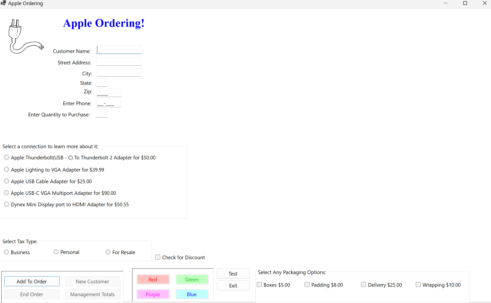

# Description
This C# program, built with Windows Forms, serves as a straightforward order form for computer parts. Users can input customer details, select desired parts along with their quantities, and choose from three different tax options. Additionally, customers have the flexibility to opt for various package options, each incurring an additional cost. The program utilizes multilevel accumulation to continuously update a running total of items purchased and the corresponding total cost for each customer. Furthermore, it maintains a cumulative record for management, tracking both total profits and the number of customers served. 
# Images

